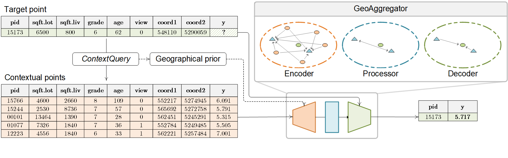
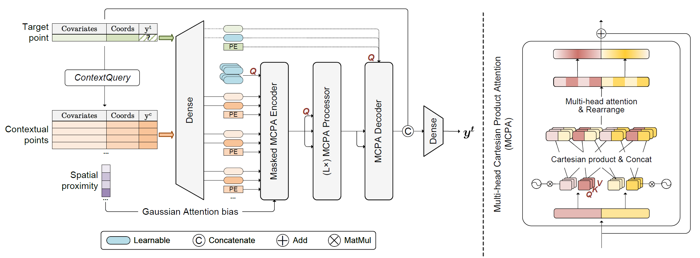

# GeoAggregator: An Efficient Transformer Model for Geo-Spatial Tabular Data

## 🌍 Introduction

* We introduce GeoAggregator (GA), an efficient & lightweight transformer architecture
designed specifically for geospatial tabular data modeling.

* GAs explicitly account for spatial auto-correlation and spatial heterogeneity through Gaussian-biased local attention
and global positional awareness.

* We also introduce a new attention mechanism that uses the Cartesian product to manage the size of the model
while preserving a strong expressive power.

### TL;DR: We focus on the spatial regression task of geospatial tabular data...



### ... and propose an efficient and light-weight transformer model named *GeoAggregator*.



## 🤖 Sklearn-style interface

* We provide a simple sklearn-style interface of **GeoAggregator (GA)**, to apply the model on *your own
  geospatial tabular datasets*.
  
* Through this interface, hyperparameter tuning and model ensemble are made possible.

## 🗿 Toy datasets

* [Original synthetic datasets (without SNR control)](data/tabular_datasets)
* [New synthetic datasets (with SNR control)](data/tabular_datasets/snr-control)
* [4 Real-world datasets](data/tabular_datasets)


## 🔥 Usage

### Installation

To get started with the GA-sklearn, please follow these steps:

1. Clone the repository:
   ```bash
   git clone https://github.com/ruid7181/GA-sklearn.git
   cd GA-sklearn
   ```

2. Install dependencies using the requirements file:
   ```bash
   pip install -r requirements.txt
   ```

3. Run the demo notebook to see GeoAggregator in action.
  The tutorial for a quick start can be found [here](demo.ipynb).

### Requirements

Dependencies are listed in the `requirements.txt` file.

## 📚 Citation

```bibtex
@inproceedings{deng2025geoaggregator,
  title={GeoAggregator: An Efficient Transformer Model for Geo-Spatial Tabular Data},
  author={Deng, Rui and Li, Ziqi and Wang, Mingshu},
  booktitle={Proceedings of the AAAI Conference on Artificial Intelligence},
  volume={39},
  number={11},
  pages={11572--11580},
  year={2025}
}
```